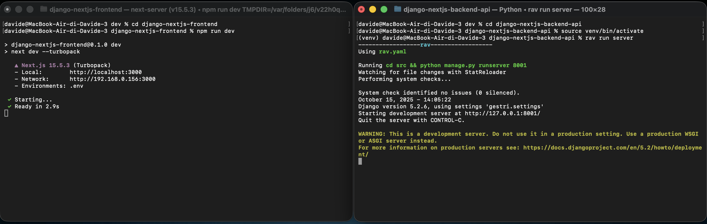

# 🦺 GESTRI — Gestionale Rifiuti Industriali

**`Django + Next.js Fullstack App`**

[](https://www.python.org/)
[](https://www.djangoproject.com/)
[](https://nodejs.org/)
[](https://nextjs.org/)  
[](https://www.sqlite.org/)
[](https://developer.mozilla.org/docs/Web/JavaScript)
[](https://developer.mozilla.org/docs/Web/CSS)
[](https://tailwindcss.com/)

---

## 🎯 Panoramica

**GESTRI** è un gestionale per la tracciabilità e la gestione dei rifiuti industriali.  
Il progetto è composto da due parti principali:

- **Backend:** `django-nextjs-backend-api` — REST API basata su Django (Python).
- **Frontend:** `django-nextjs-frontend` — interfaccia basata su Next.js + React.

L’obiettivo è fornire un’applicazione completa per la gestione del ciclo dei rifiuti: upload documenti, anagrafiche, mezzi, utenti e workflow operativi.

La **Tesina in formato PDF** offre una sintesi discorsiva della progettazione del sistema descrivendo i requisiti funzionali, l'architettura software, le principali scelte tecnologiche e i diagrammi chiave del progetto.

Puoi consultarla o scaricarla qui: [Tesina (PDF)](./Tesina%20-%20LaTeX/tesina.pdf)

---

## 🛠️ Tecnologie principali

- **Backend**

  - Python >= 3.13.7 <= 3.14 (non ancora compatibile)
  - Django >= 5.2.6
  - SQLite
  - Dipendenze: `dev/django-nextjs-backend-api/requirements.txt`

- **Frontend**

  - Node.js (LTS consigliato) >= 22.19.0
  - Npm >= 11.6.0
  - Next.js >= 13
  - Tailwind CSS

- **Tooling**
  - `rav` (wrapper opzionale per comandi: `rav run server`, `rav run test`, ecc.)

---

## 🗂️ Struttura del repository

```
GESTRI-Gestionale-Rifiuti-Industriali/
├── dev/
│   ├── django-nextjs-backend-api/
│   │   ├── src/
│   │   └── requirements.txt
│   └── django-nextjs-frontend/
│       ├── src/
│       ├── public/
│       └── package.json
├── Tesina - LaTeX/
└── README.md
```

### 📂 Percorsi file e come aprire il terminale in una cartella

Una breve nota su come muoversi tra le cartelle e aprire un terminale già posizionato nella directory desiderata:

- Puoi cercare la cartella nel Finder (macOS) o nell'Explorer (Windows). Con il tasto destro sulla cartella seleziona "Apri nel Terminale" / "Apri PowerShell qui" quando disponibile.
- In macOS puoi trascinare la cartella direttamente nella finestra del terminale: questo inserirà il percorso completo; poi premi Invio per posizionarti lì (usa il comando `cd` se necessario).
- In alternativa usa il comando cd nel terminale. Esempio: `cd /percorso/alla/cartella`.

Ci sono diverse sezioni nel README dove è importante trovarsi nel percorso corretto prima di eseguire i comandi: presta attenzione al prompt del terminale e alla cartella corrente (puoi usare `pwd` su macOS/Linux o `cd` senza argomenti su Windows per verificarla).

---

## ⚙️ Installazione e Setup

Prima di eseguire i comandi qui sotto apri due finestre (o tab) del terminale e posizionati nella cartella in cui vuoi installare l'applicazione. In una finestra eseguirai i comandi per il frontend (installazione e avvio), nell'altra quelli per il backend (installazione e avvio). Assicurati che il prompt di ciascun terminale indichi la cartella corretta prima di lanciare i comandi — questo evita errori legati al percorso.

Di seguito è riportato uno screenshot (macOS) che mostra due terminali affiancati con i comandi di avvio per l'esecuzione locale dell'applicazione.



### 🐍 Backend -- macOS / Linux (zsh)

```bash
# Verifica versione di Python
python3 --version
```

Installa Python >= 3.13.7 <= 3.14 (non ancora compatibile) se non presente nel sistema operativo:

macOS:

```bash
brew install python@3.13
```

Linux (Debian/Ubuntu):

```bash
sudo apt install python3
```

Assicurati di avere git installato prima di clonare la repository. Verifica con:

```bash
git --version
```

Se non è installato, installalo su macOS con Homebrew:

```bash
brew install git
```

Oppure segui le istruzioni su https://git-scm.com/downloads.

```bash
# Clona il repository
git clone https://github.com/davideronchini/GESTRI-Gestionale-Rifiuti-Industriali.git
```

```bash
# Aggiorna pip e installa i requirements
python3 -m pip install --upgrade pip
```

```bash
# Spostati nella cartella django-nextjs-backend-api
cd GESTRI-Gestionale-Rifiuti-Industriali/dev/django-nextjs-backend-api
```

### 🐍 Backend -- Windows (PowerShell)

```powershell
# Verifica versione di Python
python --version
```

Installa Python >= 3.13.7 <= 3.14 (non ancora compatibile) se non presente nel sistema operativo:

```powershell
winget install Python.Python.3.13
```

Assicurati di avere git installato prima di clonare la repository. Verifica con:

```powershell
git --version
```

Se non è installato, installalo su Windows con winget:

```powershell
winget install --id Git.Git
```

Oppure segui le istruzioni su https://git-scm.com/downloads.

```powershell
# Clona il repository
git clone https://github.com/davideronchini/GESTRI-Gestionale-Rifiuti-Industriali.git
```

```powershell
# Aggiorna pip e installa i requirements
python -m pip install --upgrade pip
```

```powershell
# Spostati nella cartella django-nextjs-backend-api
cd GESTRI-Gestionale-Rifiuti-Industriali/dev/django-nextjs-backend-api
```

### 🌐 Frontend -- macOS / Linux (zsh)

```bash
# Verifica versione di Node.js
node --version
npm --version
```

```bash
# Installa Node.js LTS (per macOS)
brew install node
```

```bash
# Installa Node.js LTS (per Linux)
curl -fsSL https://deb.nodesource.com/setup_lts.x | sudo -E bash -
sudo apt-get install -y nodejs
```

```bash
# Vai nella cartella frontend e installa le dipendenze
cd GESTRI-Gestionale-Rifiuti-Industriali/dev/django-nextjs-frontend
```

```bash
npm install
```

### 🌐 Frontend -- Windows (PowerShell)

```powershell
# Verifica versione di Node.js
node --version
npm --version
```

```powershell
# Installa Node.js LTS con winget
winget install OpenJS.NodeJS.LTS
```

```powershell
# Vai nella cartella frontend e installa le dipendenze
cd GESTRI-Gestionale-Rifiuti-Industriali\dev\django-nextjs-frontend
```

```powershell
npm install
```

---

## 🚀 Esecuzione

### 🐍 Backend -- Windows (PowerShell, Cmd) / macOS / Linux (zsh)

Apri un terminale nella cartella del progetto e digita:

```bash
# Attiva l’ambiente virtuale e avvia il server
cd GESTRI-Gestionale-Rifiuti-Industriali/dev/django-nextjs-backend-api
```

Se il `virtualenv (venv)` non esiste ancora, crealo prima di procedere. Se il comando sotto non funziona assicurati di avere i permessi necessari.

```powershell
# Windows (PowerShell / CMD)
python -m venv venv
```

```bash
# macOS / Linux (zsh)
python3 -m venv venv
```

```powershell
# Per Windows (PowerShell)
venv\Scripts\Activate.ps1
```

```powershell
# Per Windows (Cmd)
venv\Scripts\activate.bat
```

```bash
# Per macOS / Linux (zsh)
source venv/bin/activate
```

Installa i requisiti necessari a Django (basta farlo una volta, al primo avvio dopo l'installazione - non è necessario dalla seconda esecuzione in avanti)

```powershell
# Windows (PowerShell / CMD)
python -m pip install -r requirements.txt
```

```bash
# macOS / Linux (zsh)
python3 -m pip install -r requirements.txt
```

Se utilizzi lo script `rav` (opzionale), avvia il server con il comando seguente:

```bash
rav run server
```

Se il comando precedente non funziona (assicurati prima di aver attivato l'ambiente virtuale `venv`), puoi eseguire lo script senza attivare l'ambiente spostandoti nella cartella `src` ed eseguendo i comandi indicati qui sotto. Verifica di trovarti nella cartella corretta con `pwd` (macOS/Linux) o `cd` senza argomenti (Windows).

```powershell
# Avvio manuale (porta 8001) - Windows (PowerShell / CMD)
cd src
python manage.py runserver 127.0.0.1:8001
```

```bash
# Avvio manuale (porta 8001) - macOS / Linux (zsh)
cd src
python3 manage.py runserver 127.0.0.1:8001
```

### 🌐 Frontend -- macOS / Windows / Linux

```bash
# Avvia l’applicazione Next.js in modalità sviluppo
cd GESTRI-Gestionale-Rifiuti-Industriali/dev/django-nextjs-frontend
```

```bash
npm run dev
```

Apri il browser su:
👉 http://localhost:3000

---

## 🧪 Test

### 🐍 Backend

Apri un terminale nella directory del backend:

```bash
cd GESTRI-Gestionale-Rifiuti-Industriali/dev/django-nextjs-backend-api
```

```powershell
# Per Windows (PowerShell)
venv\Scripts\Activate.ps1
```

```powershell
# Per Windows (Cmd)
venv\Scripts\activate.bat
```

```bash
# Per macOS / Linux (zsh)
source venv/bin/activate
```

```bash
rav run test
```

Se il comando precedente non funziona (assicurati prima di aver attivato l'ambiente virtuale `venv`), puoi eseguire lo script senza attivare l'ambiente spostandoti nella cartella `src` ed eseguendo i comandi indicati qui sotto. Verifica di trovarti nella cartella corretta con `pwd` (macOS/Linux) o `cd` senza argomenti (Windows).

```powershell
# Per Windows (PowerShell/Cmd)
cd src && python manage.py test
```

```bash
# Per macOS / Linux (zsh)
cd src && python3 manage.py test
```

## 🔗 Collegamenti utili (sviluppo)

- Backend (base URL): http://127.0.0.1:8001
- Pannello Admin: http://127.0.0.1:8000/admin
- API Routes: http://127.0.0.1:8000/api
- Frontend: http://localhost:3000

## 📎 Note finali

- Assicurati che le versioni di Python e Node.js LTS siano installati e accessibili dal terminale.
- Nel caso non funzionino i comandi in cui si usa `python` prova con `python3` e viceversa.
- Assicurati di aver installato le dipendenze elencate in `requirements.txt` nel virtual environment `venv` la prima volta che prepari il backend. Esempi:

Windows (PowerShell / CMD):

```powershell
venv\Scripts\Activate.ps1  # oppure activate.bat su CMD
python -m pip install -r requirements.txt
```

macOS / Linux (zsh):

```bash
source venv/bin/activate
python3 -m pip install -r requirements.txt
```

- rav è opzionale: puoi sempre avviare Django con `python manage.py runserver`.
- In produzione, si consiglia di sostituire SQLite con PostgreSQL o MySQL.
